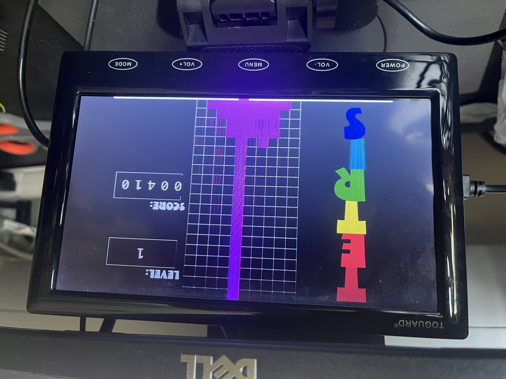

# FPGA-Based Tetris Game
## ECE 350: Digital Systems Final Project

### Team Members
- Shriya Challam
- Arnav Nayak

### Project Overview
This project involved creating a simplified version of the classic Tetris game on an FPGA board. The game utilizes a VGA display for visualization and FPGA board buttons for user input to control the Tetris blocks. The main features include scoring, multiple game levels, and dynamic speed adjustments based on the game level.

### Game Showcase

#### Photo

#### Video
To see the game in action, watch this short video:
[Watch Tetris Game Video](video_gameplay.MOV)

### Key Features
- **Game Design**: Utilizes a standard Tetris grid with a set of 3-5 unique Tetris blocks.
- **Controls**: Players can move the falling blocks left and right using the FPGA board buttons.
- **Scoring and Levels**: Includes scoring mechanisms and level advancements based on scores.
- **Display**: Outputs game status (current level and score) on a VGA display.

### Technical Specifications
- **Processor Modifications**: Minimal changes were made to optimize memory-mapped input/output operations.
- **Memory Usage**: Utilizes the first 200 bits for game grid state management, with additional bits for current block position, score, and game level.
- **Custom Modules**: Developed a binary_converter Verilog module to display scores and levels in decimal format on the VGA screen.

### Challenges
- Managing game logic effectively between the processor and the VGA controller.
- Handling complex block designs and optimizing memory usage due to limited BRAM.

### Future Improvements
- **Row Clearing**: Implement functionality to clear filled rows and manage block shifts accordingly.
- **Block Rotation**: Add block rotation features to enhance gameplay dynamics.

### Testing
- Utilized Verilog test benches for module verification and an online MIPS interpreter for simulating assembly code behavior.

### Repository Contents
- `FPGA_Code/`: All Verilog and MIPS code files for the project.
- `Documentation/`: Detailed project reports and design specifications.
- `Images/`: Visuals and diagrams used in documentation.

### Setup and Running
1. Configure the FPGA board with provided Verilog files.
2. Compile and load MIPS code onto the FPGA.
3. Connect to a VGA display and start the game using the on-board buttons.

For detailed information on each component and setup instructions, please refer to the accompanying project documentation files.

### Acknowledgments
Special thanks to our project advisor and the ECE technical staff who provided invaluable feedback and support throughout the project development.

